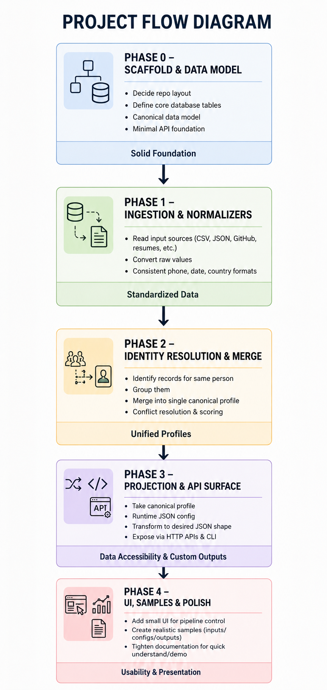
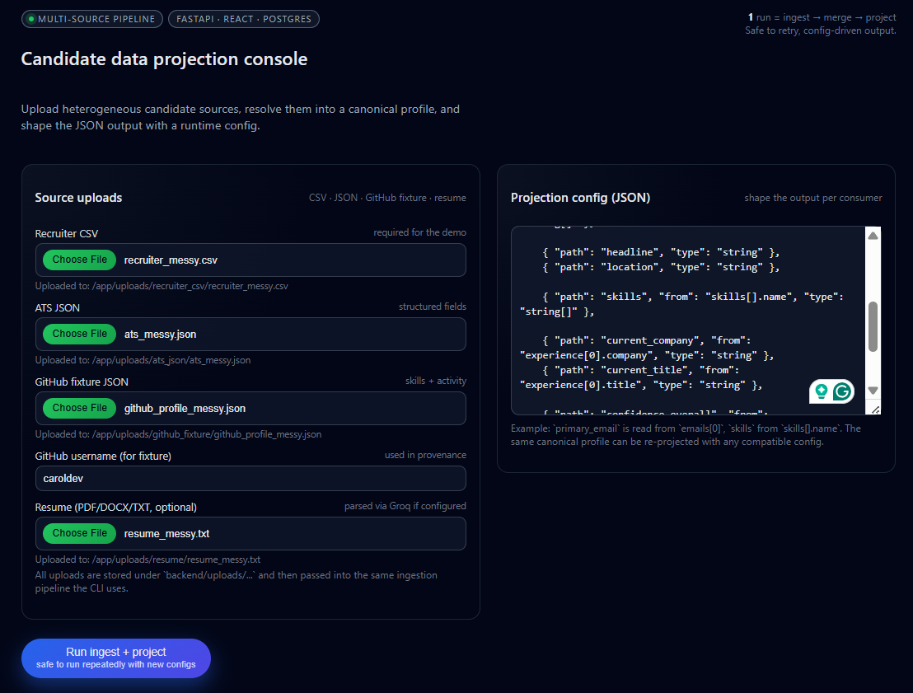
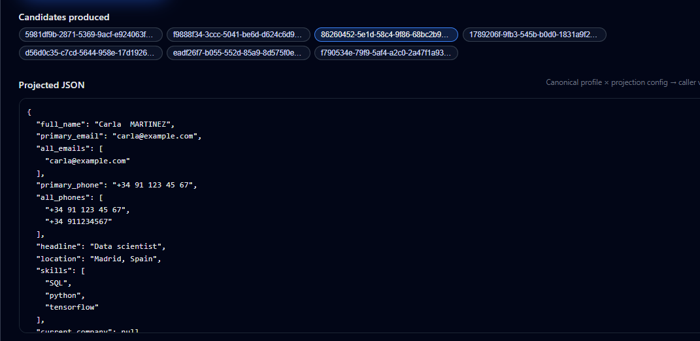

## Multi-Source Candidate Data Transformer

Backend-first system for **ingesting heterogeneous candidate data**, merging it into a **canonical profile** in Postgres, and exposing **config-driven JSON projections** via FastAPI and a small React UI.

The core idea is to **separate ingestion/merging from output shape**:

- **Ingest**: per-source adapters emit `FieldObservation` records.
- **Merge**: identity resolution + conflict resolution build a canonical `CandidateProfile`.
- **Project**: a runtime JSON config (`ProjectionConfig`) maps canonical data into caller-specific JSON.

### 0.1 High-impact design decisions (at a glance)

| **Area**                    | **Decision**                                                                 | **Why it matters**                                                                                           |
|-----------------------------|------------------------------------------------------------------------------|--------------------------------------------------------------------------------------------------------------|
| Canonical vs. output shape  | Strict 3-layer split: ingest/merge → canonical profile → config-driven projection. | New consumers change only configs, **never ETL or DB schema**, keeping the system easy to evolve safely.    |
| Observation-first ingest    | Everything is first a `FieldObservation` with provenance + raw confidence.  | You can always **rebuild profiles and projections** without re-running expensive extraction or LLM calls.   |
| Explicit scoring + tiers    | Identity + merge driven by **documented weights and source tiers**.         | Matching is **explainable and tunable** instead of opaque heuristics baked into scattered code.             |
| Config-driven projection    | Callers define JSON shape via stored `ProjectionConfig`.                    | One canonical truth, **many caller shapes**; adding a dashboard or integration is a config change, not code.|
| Provenance & confidence     | Keep all conflicting values + per-field confidence and `overall_confidence`.| Downstream systems can **see ambiguity instead of hiding it**, and decide their own risk tolerance.         |

---

## 1. Repo layout (at a glance)

| Area        | Path          | What it contains                                                  |
|------------|---------------|--------------------------------------------------------------------|
| Backend    | `backend/`    | FastAPI app, SQLAlchemy models, identity/merge engine, projection, CLI |
| Frontend   | `frontend/`   | React + Vite SPA to upload sources, edit config, view JSON output |
| Samples    | `samples/`    | Example inputs and a default projection config                    |
| Infra      | `docker-compose.yml` | Postgres + backend + frontend for local runs              |
| Design doc | `Design.md`   | Longer-form architecture notes and build plan                     |

---

## 2. Architecture summary



- **Ingestion / extraction**
  - Adapters convert each source into `FieldObservation` objects:
    - `backend/app/adapters/recruiter_csv.py` (CSV)
    - `backend/app/adapters/ats_json.py` (ATS JSON)
    - `backend/app/adapters/github_stub.py` (GitHub fixture JSON)
    - `backend/app/adapters/resume_llm.py` (resume via Groq LLM)
  - All adapters are defensive: missing/malformed input → log + return `[]` (no crash).

- **Identity resolution + canonicalization**
  - Implemented in `backend/app/identity.py` using feature extraction + scoring:
    - Blocking on shared email/phone/name; scoring via `rapidfuzz` + source tiers.
    - Clusters of `candidate_ref` are turned into deterministic `CandidateProfile` IDs.
  - Canonical schema lives in `backend/app/schemas.py` (`CandidateProfile`, `Skill`, etc.).

- **Projection layer**
  - Implemented in `backend/app/projection.py`:
    - `ProjectionConfig` describes desired output fields and types.
    - Simple JSONPath-like resolver supports `a.b`, `a[0]`, `a[].b` (e.g. `emails[0]`, `skills[].name`).
    - `on_missing` controls whether missing data becomes `null`, is omitted, or raises an error.

Key persistence tables (see `backend/app/models/candidate.py`):

| Table               | Purpose                                      |
|---------------------|----------------------------------------------|
| `candidates`        | Canonical profile JSON + `overall_confidence` |
| `raw_observations`  | One row per ingested `FieldObservation`      |
| `projection_configs`| Stored named `ProjectionConfig` definitions  |

---

## 3. How data flows through the system

1. **Collect sources**  
   CLI, API, or UI specify paths (or uploaded files) per source type.
2. **Extract**  
   Adapters emit `FieldObservation` objects (`backend/app/observations.py`).
3. **Normalize core fields**  
   `backend/app/normalization.py`:
   - `normalize_phone` → E.164 (via `phonenumbers`)
   - `normalize_year_month` → `YYYY-MM` (via `dateutil`)
   - `normalize_country` → ISO alpha-2 (via `pycountry`)
4. **Resolve identity + merge**  
   `backend/app/identity.py` groups refs into clusters and builds `CandidateProfile` objects.
5. **Persist**  
   `backend/app/services/ingest.py` upserts `candidates` and stores `raw_observations`.
6. **Project**  
   `project_profile` in `backend/app/projection.py` applies a `ProjectionConfig` to a profile.

### 3.1 Identity resolution & scoring rules (tabular)

| **Aspect**           | **Rule / Value**                                                                                                   | **Impact**                                                                                                  |
|----------------------|---------------------------------------------------------------------------------------------------------------------|-------------------------------------------------------------------------------------------------------------|
| Blocking keys        | Shared **normalized email**, **normalized phone**, or exact **normalized full name**.                             | Limits comparisons to promising pairs so resolution stays fast even as data grows.                          |
| Pair scoring formula | `score = 0.7·email_match + 0.5·phone_match + 0.3·name_similarity + 0.1·corroboration(company ∧ skills)` (capped ≤1).| Makes “why these two merged?” **auditable** instead of magic thresholds hidden in code.                    |
| Merge threshold      | **Merge if score ≥ 0.7**, otherwise keep candidates separate.                                                      | Prefers **missed merges over false merges**, protecting profile integrity.                                 |
| Source trust tiers   | `recruiter_csv`, `ats_json` (tier 4) > GitHub/LinkedIn (3) > resume LLM (2) > free-text notes (1).                 | Higher-tier sources dominate conflicts; low-tier-only values get confidence caps.                          |
| Corroboration boost  | If ≥2 independent sources agree on a value, confidence boosted (≈0.9–0.95); single-source winners capped (≤0.6).   | **Independent agreement beats any single source**, which matches how humans trust data.                    |
| List fields          | `emails[]`, `phones[]`, `skills[]` are **unioned** with per-element confidence, never winner-take-all.             | Prevents loss of valid emails/skills; downstream consumers see the full contact/skill surface area.        |
| Overall confidence   | `overall_confidence` is a weighted roll-up of non-zero field confidences.                                          | Lets ranking/filtering logic favor **well-supported profiles** without re-implementing scoring.            |

---

## 4. API quick reference

All endpoints are served by the FastAPI app in `backend/app/main.py`.

| Method & path                       | Purpose                                   |
|-------------------------------------|-------------------------------------------|
| `GET /health`                       | Basic health check                        |
| `POST /candidates/ingest`          | Run ingestion + merge for given sources   |
| `POST /candidates/{id}/project`    | Project a candidate using inline config   |
| `GET /candidates/{id}/project`     | Project a candidate using stored config or a default |
| `POST /configs`                    | Create or update a named projection config |
| `GET /configs`                     | List stored configs                       |
| `GET /configs/{name}`              | Fetch a single stored config              |
| `POST /uploads/{source_type}`      | Upload a source file and get its backend path |

**Ingest request shape (simplified)**:


```json
{
  "sources": [
    { "type": "recruiter_csv", "path": "/abs/path/to/recruiter.csv" },
    { "type": "ats_json", "path": "/abs/path/to/ats.json" },
    { "type": "github_fixture", "path": "/abs/path/to/github.json", "username": "caroldev" },
    { "type": "resume", "path": "/abs/path/to/resume.pdf" }
  ]
}
```

**Projection config (simplified)**:

```json
{
  "fields": [
    { "path": "full_name", "type": "string", "required": true },
    { "path": "primary_email", "from": "emails[0]", "type": "string", "required": true },
    { "path": "skills", "from": "skills[].name", "type": "string[]" }
  ],
  "on_missing": "null"
}
```

---

## 5. Frontend (quick tour)


- **File uploads**: send files to `/uploads/{source_type}` and show the server path you can reuse for ingestion.
- **Config editor**: textarea pre-populated with the default projection config (you can tweak and re-run).
- **Run button**: triggers `POST /candidates/ingest` then immediately `POST /candidates/{id}/project` for the first candidate.
- **Candidate selector**: buttons for each candidate ID let you re-project with the current config.
- **Result panel**: pretty-printed JSON output for quick inspection.



The UI is intentionally minimal and focused on making the pipeline observable, not on visual polish.

---

## 6. Edge cases and robustness (high level)

- **Empty / malformed sources**: empty CSVs, malformed ATS JSON, and missing files all short-circuit to “no observations” instead of failing the pipeline.
- **Merge correctness**: shared-email candidates are merged; obviously different people (no shared identifiers + low name similarity) remain separate.
- **Conflicting information**: conflicting experiences from different sources are both retained in `experience[]` so discrepancies are visible.
- **Dates & phones**: unparseable dates and invalid phone numbers become `None` / invalid-normalization results instead of guessed values.
- **Bad configs**: invalid projection configs (unknown root fields, wrong shapes) are rejected with clear errors in both CLI and API tests.

Backend tests in `backend/tests/` cover these scenarios end-to-end (adapters, normalization, identity, projection, CLI, API).

---

## 7. Complexity & scalability (big-O overview)

These are **asymptotic** costs in terms of:
- **N** = total number of `FieldObservation` rows.
- **C** = number of logical candidates.
- **B** = average block size after blocking (candidates sharing at least one blocking key).

| **Stage**                       | **Operation**                                            | **Complexity (time)**         | **Notes**                                                                                 |
|---------------------------------|----------------------------------------------------------|-------------------------------|-------------------------------------------------------------------------------------------|
| Ingestion + normalization       | Parse sources → `FieldObservation[]` + normalize fields | ≈ **O(N)**                    | Linear in number of observations; adapters are pure streaming transforms.                 |
| Blocking for identity           | Build blocking keys (email/phone/name)                  | **O(C)** buckets              | Each candidate contributes a small constant number of blocking keys.                      |
| Pairwise scoring within blocks  | Score pairs that share a block                          | **O(∑ B²)** (per block)       | In practice kept small by strong blocking keys (email/phone).                             |
| Cluster formation (union-find)  | Union candidate refs into clusters                      | **O(C α(C))**                 | Essentially linear; `α` is the inverse Ackermann function (≈constant in real workloads).  |
| Merge within a cluster          | Per-field winner + provenance                           | **O(N)**                      | Iterate observations once, grouped by field.                                              |
| Projection for one candidate    | Apply `ProjectionConfig` via dot/array resolver         | **O(F · L)**                  | `F` = number of configured fields, `L` = path length; typically small constants.          |
| API request (ingest + project)  | End-to-end for a handful of sources                     | **O(N + ∑ B² + F · L)**       | Easily fits within a single FastAPI request for the “thousands of candidates” target.     |

The pipeline is **pure-function by design**, so heavier deployments can move ingestion + merge into background workers or batch jobs without changing any business logic.

---

## 8. Running the project

### 8.1 Fast path with Docker

From the repo root:

```bash
docker compose up --build
```

- Backend: `http://localhost:8000` (docs at `/docs`).
- Frontend: `http://localhost:5173`.

### 8.2 Backend only (local Python)

```bash
cd backend
python -m venv .venv
.venv\Scripts\activate  # Windows
# source .venv/bin/activate  # Unix
pip install -r requirements.txt
uvicorn app.main:app --reload
```

Optionally set `GROQ_API_KEY` if you want real resume parsing through Groq; otherwise the resume adapter quietly returns no observations.

### 8.3 Frontend dev server

```bash
cd frontend
npm install
npm run dev
```

---

## 9. Running tests

From `backend/`:

```bash
pytest
```

This exercises adapters, normalization, identity/merge logic, projection behavior, CLI ingestion, and the main API endpoints. Frontend is simple enough to validate manually by running through the sample fixtures and configs.


sample config: 

{
  "fields": [
    { "path": "full_name", "type": "string", "required": true },

    { "path": "primary_email", "from": "emails[0]", "type": "string", "required": true },
    { "path": "all_emails", "from": "emails", "type": "string[]" },

    { "path": "primary_phone", "from": "phones[0]", "type": "string" },
    { "path": "all_phones", "from": "phones", "type": "string[]" },

    { "path": "headline", "type": "string" },
    { "path": "location", "type": "string" },

    { "path": "skills", "from": "skills[].name", "type": "string[]" },

    { "path": "current_company", "from": "experience[0].company", "type": "string" },
    { "path": "current_title", "from": "experience[0].title", "type": "string" },

    { "path": "confidence_overall", "from": "overall_confidence", "type": "string" }
  ],
  "include_provenance": false,
  "include_confidence": true,
  "on_missing": "null"
}